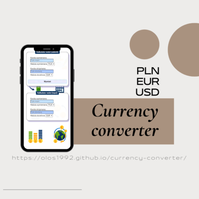

# ALEKSANDER SKUŁA - CURRENCY CONVERTER



## Table of contents

1. [Description](#description)
1. [Technologies](#technologies)
1. [Demo](#demo)
1. [Example of the JS code](#example-of-the-js-code)


## Description

This is my second project based on the [**YouCode - Frontend Developer Course**](https://youcode.pl). It is a simple currency converter with the 3 most popular currencies, including PLN, EUR and USD.

## Technologies
The application is built with use of:

- *HTML5*
- *CSS3*
- *JavaScript with ES6+ features*
- *BEM methodology*

## Example of the JS code

```js
        const calculateInput = () => {

            const amountInInput = document.querySelector(".js-amountInInput");

            const currencyInVal = document.querySelector(".js-currencyInInput");
            const currencyOutVal = document.querySelector(".js-currencyOutInput");

            switch (currencyInVal.value + currencyOutVal.value) {
                case "PLNPLN":
                case "EUREUR":
                case "USDUSD":
                    return amountInInput.value;

                case "PLNEUR":
                    return (amountInInput.value * 0.207).toFixed(2);

                case "PLNUSD":
                    return (amountInInput.value * 0.204).toFixed(2);

                case "EURPLN":
                    return (amountInInput.value * 4.81).toFixed(2);

                case "EURUSD":
                    return (amountInInput.value * 0.99).toFixed(2);

                case "USDPLN":
                    return (amountInInput.value * 4.89).toFixed(2);

                case "USDEUR":
                    return (amountInInput.value * 1.01).toFixed(2);
            }

        }
```

## Demo

(https://olos1992.github.io/currency-converter/)
